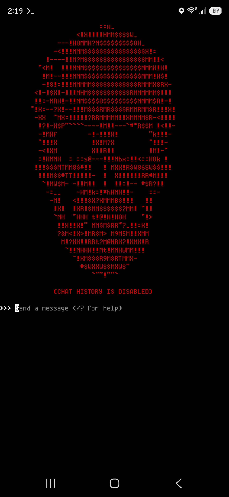

# Ollama-Android-V.1

> Run a fully offline, zero-history LLM on Android using Termux and Ollama — no cloud, no logs, no telemetry.

---

## Overview

This guide walks you through installing Ollama on Android via Termux, optionally creating a custom model with a system prompt, and configuring your shell so history is permanently disabled across every session. Includes optional launch scripts for a one-command startup experience.

---

## Prerequisites

- Android device with [Termux](https://play.google.com/store/apps/details?id=com.termux) installed
- Enough storage for your model (varies — most models are 4–8GB)
- An internet connection for the initial setup (after that, fully offline)

---

## Step 1 — Install Ollama

Open Termux and run the following commands one at a time:

```bash
pkg install tur-repo
```

```bash
pkg update
```

```bash
pkg install ollama
```

---

## Step 2 — Pull Your Model

This guide uses `dolphin-mistral` as an example, but you can use any model from [ollama.com/library](https://ollama.com/library):

```bash
ollama pull dolphin-mistral
```

> This may take a few minutes depending on your connection speed and model size.

---

## Step 3 — Disable History Permanently (Recommended)

To ensure zero history across all Termux and Ollama sessions, add two lines to your shell config.

Open your bash configuration file:

```bash
nano ~/.bashrc
```

Scroll to the bottom and add these two lines:

```bash
set +o history
export OLLAMA_NOHISTORY=1
```

Save with `Ctrl+O` then `Enter`, and exit with `Ctrl+X`.

Apply the changes immediately:

```bash
source ~/.bashrc
```

This runs automatically on every new Termux session going forward.

---

## Step 4 — Create a Modelfile (Optional)

Skip this step if you just want to run a base model as-is.

A Modelfile lets you bake a system prompt into a custom model so it starts every session with your instructions already loaded.

Create the file:

```bash
touch modelfile
nano modelfile
```

Paste the following, replacing the model name and prompt with your own:

```
FROM dolphin-mistral
SYSTEM "Your system prompt goes here."
```

**Example:**

```
FROM dolphin-mistral
SYSTEM "You are a helpful assistant. Be concise and direct. Never mention that you are an AI."
```

Save with `Ctrl+O` then `Enter`, and exit with `Ctrl+X`.

Create your custom model:

```bash
ollama create CUSTOM_MODEL_NAME -f ./modelfile
```

Verify it was created:

```bash
ollama list
```

---

## Step 5 — Run It

Running Ollama on Android requires two Termux consoles — one to serve the model, one to talk to it.

**In your first console**, start the Ollama server:

```bash
ollama serve
```

**Open a second console** by swiping right from the left edge of the screen, then tap the `+` to open a new session.

**In the second console**, run your model:

```bash
# If you created a custom model:
ollama run CUSTOM_MODEL_NAME

# If you want to run the base model directly:
ollama run dolphin-mistral
```

Type your questions and press Enter. Use `/bye` or `Ctrl+C` to exit.

---

## Step 6 — Launch Scripts (Optional)

To avoid opening two consoles and typing commands every time, you can use these two scripts to automate startup.

**`ollama_serve.sh`** — starts the Ollama server  
**`rebel_android.sh`** — waits for the server, then launches your model with a styled intro

Download both files from this repo, then copy them into Termux and make them executable.

First, grant Termux access to your storage (required once):

```bash
termux-setup-storage
```

Then copy and enable the scripts:

```bash
cp /sdcard/Download/ollama_serve.sh ~/ollama_serve.sh
cp /sdcard/Download/rebel_android.sh ~/rebel_android.sh
chmod +x ~/ollama_serve.sh ~/rebel_android.sh
```

**To use:**

Open your **first console** and run:

```bash
~/ollama_serve.sh
```

Swipe right to open a **second console**, then run:

```bash
~/rebel_android.sh
```

The script will wait for the server to be ready, then launch your model automatically.

> **Note:** `rebel_android.sh` is set up to run a model named `rebel`. Edit the last line of the script to match your own model name:
> ```bash
> OLLAMA_NOHISTORY=1 ollama run YOUR_MODEL_NAME
> ```

---

## How It Works

| Feature | Detail |
|---|---|
| **Zero history** | `set +o history` and `OLLAMA_NOHISTORY=1` disable all logging permanently |
| **System prompt** | Baked into the model at creation — loads automatically every run |
| **Fully offline** | After the initial pull, no internet connection is needed |
| **Two consoles** | Termux requires one session for `ollama serve` and one to run the model |
| **Launch scripts** | Automate startup and add a styled intro with zero manual steps |

---

## Customization Tips

- **Change the system prompt** — edit the `modelfile` and re-run `ollama create` with the same name to overwrite it
- **Multiple models** — create several modelfiles for different use cases (e.g. a coding assistant, a writing assistant, a research assistant)
- **Typewriter speed** — adjust the `sleep 0.04` value in `rebel_android.sh` to make the intro faster or slower
- **Change the color** — swap `RED='\033[0;31m'` for `GREEN='\033[0;32m'` in `rebel_android.sh` for a classic terminal look
- **Swipe to switch** — swipe right from the left edge in Termux to manage and switch between open console sessions

---



---

## Related

- [Ollama-Linux-V.1](https://github.com/quintenlittle/Ollama-Linux-V.1) — Same setup guide for Linux
- [Ollama-Windows-V.1](https://github.com/quintenlittle/Ollama-Windows-V.1) — Same setup guide for Windows
- [RAG-Technique-V.1](https://github.com/quintenlittle/RAG-Technique-V.1) — Index your personal files and query them with a local LLM

---

## License

MIT
